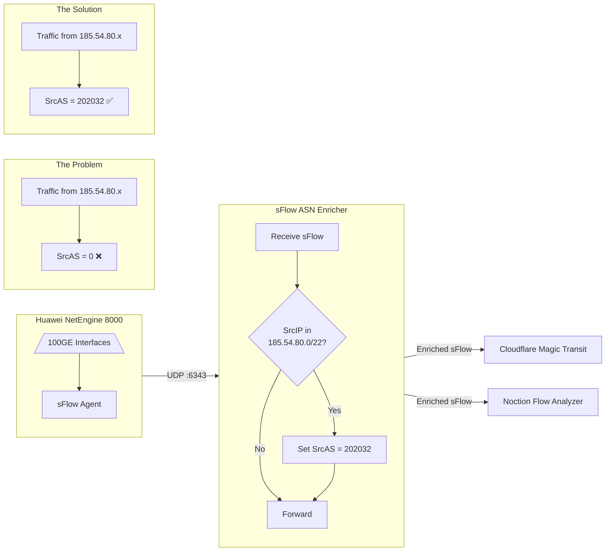
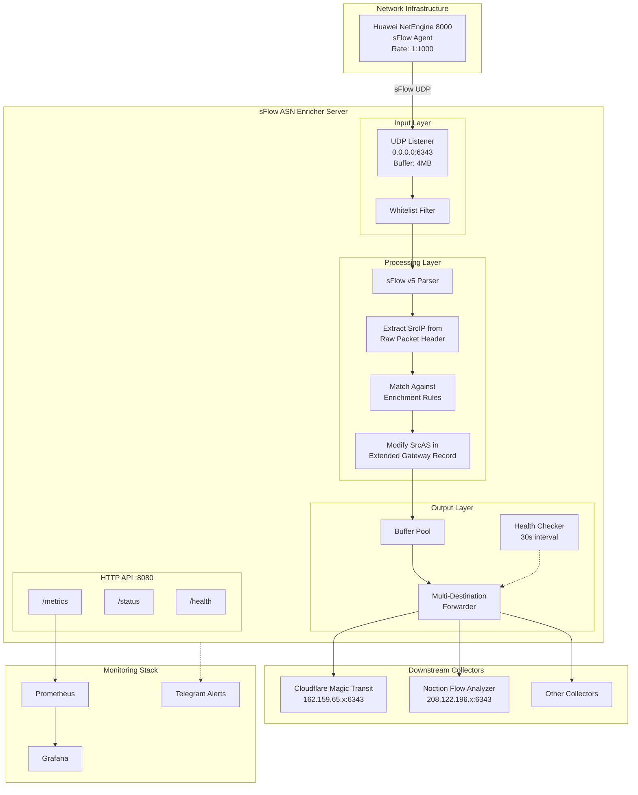

<p align="center">
  
</p>

# sFlow ASN Enrichment Integration for Huawei NetEngine

[]()
[](https://golang.org/)
[](LICENSE)
[]()
[](https://sflow.org/)

A high-performance sFlow v5 proxy specifically designed to solve the **SrcAS=0 problem** on Huawei NetEngine routers (NE8000, NE5000E, NE40E series). The proxy enriches sFlow packets with the correct Autonomous System Number before forwarding to downstream collectors such as Cloudflare Magic Transit, Noction Flow Analyzer, Kentik, or any sFlow-compatible platform.

## The Problem: Huawei NetEngine SrcAS=0 Issue

### Background

Huawei NetEngine routers (including NE8000 M8/M14/F1A, NE5000E, NE40E) generate sFlow samples for network traffic monitoring. However, when traffic **originates from the local AS** (your own network prefixes), the router sets `SrcAS = 0` in the Extended Gateway record because:

1. The traffic source IP belongs to directly connected or local networks
2. The BGP RIB lookup returns no AS path for local prefixes
3. The router correctly reports "no external AS" as `SrcAS = 0`

### Impact

This behavior causes significant issues for downstream collectors:

| Collector | Impact |
|-----------|--------|
| **Cloudflare Magic Transit** | Cannot attribute DDoS attack sources to your AS; traffic analytics incomplete |
| **Noction Flow Analyzer** | AS path analysis broken; routing optimization decisions affected |
| **Kentik** | Traffic attribution gaps; peering analysis incomplete |
| **PRTG/LibreNMS** | AS-based traffic reports show "Unknown AS" for local traffic |

### Solution

**sFlow ASN Enricher** intercepts sFlow packets, identifies flows where:
- Source IP matches your network prefixes (e.g., `185.54.80.0/22`)
- Current `SrcAS = 0` (or configurable match value)

And enriches them by setting `SrcAS` to your actual AS number (e.g., `AS202032`) before forwarding.

## How It Works



## Architecture



## Features

### Core Functionality

| Feature | Description |
|---------|-------------|
| **ASN Enrichment** | Modify `SrcAS` field in Extended Gateway records based on source IP prefix matching |
| **Multi-Destination Forwarding** | Send enriched sFlow to multiple collectors simultaneously (Cloudflare, Noction, etc.) |
| **sFlow v5 Full Support** | Parse and modify Flow Samples, Expanded Flow Samples, Raw Packet Headers, Extended Gateway |
| **IPv4 and IPv6** | Enrichment rules support both IPv4 prefixes (e.g., `185.54.80.0/22`) and IPv6 (e.g., `2a02:4460::/32`) |
| **Conditional Matching** | Only enrich when `SrcAS` equals specific value (default: 0) or force overwrite |

### Reliability & Operations

| Feature | Description |
|---------|-------------|
| **Hot-Reload Configuration** | Update enrichment rules without restart via `SIGHUP` or `systemctl reload` |
| **Destination Health Checks** | Monitor collector availability every 30 seconds with automatic status tracking |
| **Automatic Failover** | Redirect traffic to backup collector when primary becomes unavailable |
| **Source IP Whitelist** | Accept sFlow only from authorized router IPs (security hardening) |
| **Graceful Shutdown** | Complete in-flight packet processing before exit |

### Observability

| Feature | Description |
|---------|-------------|
| **Prometheus Metrics** | Native `/metrics` endpoint with counters, gauges, and per-destination statistics |
| **JSON Status API** | Real-time statistics via `/status` endpoint for integration with monitoring tools |
| **Health Endpoint** | Simple `/health` returning `OK` or `DEGRADED` for load balancer probes |
| **Structured Logging** | JSON log format for ELK/Loki/Splunk integration; configurable log levels |
| **Telegram Alerts** | Instant notifications for startup, shutdown, and destination failures |

### Performance Optimizations

| Feature | Description |
|---------|-------------|
| **Zero-Copy Buffer Pool** | Reuse packet buffers to minimize GC pressure and memory allocations |
| **Async I/O** | Dedicated goroutines for receiving, processing, and forwarding |
| **Socket Buffer Tuning** | 4MB receive buffer, 2MB send buffer per destination |
| **Minimal Parsing** | Only parse required sFlow records, skip irrelevant data |

## Performance Benchmarks

Tested on Ubuntu 24.04 LTS, Intel Xeon E-2288G, 32GB RAM:

| Metric | Value | Notes |
|--------|-------|-------|
| **Throughput** | 150,000+ pkt/s | Sustained with enrichment enabled |
| **Latency** | < 500µs | End-to-end processing time |
| **Memory Usage** | 12-18 MB | Stable under load |
| **CPU Usage** | < 3% | Single core on Xeon E-2288G |
| **Packet Loss** | 0% | With properly sized socket buffers |

## Requirements

| Component | Requirement |
|-----------|-------------|
| **Operating System** | Linux (Ubuntu 22.04/24.04 LTS, Debian 12, RHEL 9) |
| **Go** | 1.21+ (compilation only, not required at runtime) |
| **Network** | UDP port 6343 inbound from router(s) |
| **Firewall** | Outbound UDP to collector IPs on port 6343 |
| **Resources** | 1 CPU core, 64 MB RAM minimum |

## Installation

### Build from Source

```bash
# Clone repository
git clone https://github.com/paolokappa/sFlow_Enrichment_Integration_Huawei.git
cd sFlow_Enrichment_Integration_Huawei

# Build binary
make build

# Install (binary + config + systemd)
sudo make install

# Enable and start service
sudo systemctl enable --now sflow-asn-enricher
```

### Verify Installation

```bash
# Check version
sflow-asn-enricher -version
# Output: sflow-asn-enricher version 2.0.0

# Check service status
systemctl status sflow-asn-enricher

# Verify health endpoint
curl -s http://127.0.0.1:8080/health
# Output: OK

# Check statistics
curl -s http://127.0.0.1:8080/status | jq .
```

### Installed Files

| Path | Description |
|------|-------------|
| `/usr/local/bin/sflow-asn-enricher` | Executable binary (statically linked) |
| `/etc/sflow-asn-enricher/config.yaml` | Configuration file |
| `/etc/systemd/system/sflow-asn-enricher.service` | Systemd unit with security hardening |

## Configuration

Configuration file: `/etc/sflow-asn-enricher/config.yaml`

### Production Example

```yaml
# sFlow ASN Enricher Configuration
# For Huawei NetEngine 8000 integration

listen:
  address: "0.0.0.0"
  port: 6343

http:
  enabled: true
  address: "127.0.0.1"  # Bind to localhost for security
  port: 8080

# Downstream sFlow collectors
destinations:
  - name: "cloudflare-magic-transit"
    address: "162.159.65.1"
    port: 6343
    enabled: true
    primary: true

  - name: "noction-flow-analyzer"
    address: "208.122.196.72"
    port: 6343
    enabled: true
    primary: true

# ASN enrichment rules
# When SrcIP matches network AND SrcAS equals match_as, set SrcAS to set_as
enrichment:
  rules:
    - name: "company-ipv4-primary"
      network: "185.54.80.0/22"      # Your IPv4 allocation
      match_as: 0                     # Only enrich if SrcAS is 0
      set_as: 202032                  # Your AS number
      overwrite: false                # Don't overwrite if already set

    - name: "company-ipv6"
      network: "2a02:4460::/32"       # Your IPv6 allocation
      match_as: 0
      set_as: 202032
      overwrite: false

# Security: only accept sFlow from known routers
security:
  whitelist_enabled: true
  whitelist_sources:
    - "185.54.80.2"      # NetEngine 8000 management IP
    - "10.255.0.0/24"    # Internal router loopbacks

# Logging configuration
logging:
  level: "info"          # debug, info, warn, error
  format: "json"         # "text" or "json"
  stats_interval: 60     # Log statistics every 60 seconds

# Optional: Telegram notifications
telegram:
  enabled: true
  bot_token: "123456789:ABCdefGHIjklMNOpqrsTUVwxyz"
  chat_id: "-1001234567890"
  alert_on:
    - "startup"
    - "shutdown"
    - "destination_down"
```

### Configuration Reference

| Section | Parameter | Type | Default | Description |
|---------|-----------|------|---------|-------------|
| `listen` | `address` | string | `0.0.0.0` | Bind address for sFlow listener |
| `listen` | `port` | int | `6343` | UDP port for sFlow |
| `http` | `enabled` | bool | `false` | Enable HTTP API |
| `http` | `address` | string | `127.0.0.1` | HTTP bind address |
| `http` | `port` | int | `8080` | HTTP port |
| `destinations[]` | `name` | string | required | Unique identifier |
| `destinations[]` | `address` | string | required | Collector IP/hostname |
| `destinations[]` | `port` | int | required | Collector port |
| `destinations[]` | `enabled` | bool | `false` | Enable destination |
| `destinations[]` | `primary` | bool | `false` | Primary destination flag |
| `destinations[]` | `failover` | string | `""` | Failover destination name |
| `enrichment.rules[]` | `name` | string | required | Rule identifier |
| `enrichment.rules[]` | `network` | string | required | CIDR prefix to match |
| `enrichment.rules[]` | `match_as` | uint32 | required | SrcAS value to match |
| `enrichment.rules[]` | `set_as` | uint32 | required | New SrcAS value |
| `enrichment.rules[]` | `overwrite` | bool | `false` | Ignore match_as, always set |
| `security` | `whitelist_enabled` | bool | `false` | Enable source whitelist |
| `security` | `whitelist_sources` | []string | `[]` | Allowed source IPs/CIDRs |
| `logging` | `level` | string | `info` | Log level |
| `logging` | `format` | string | `text` | Log format (text/json) |
| `logging` | `stats_interval` | int | `60` | Stats log interval (seconds) |

For complete configuration reference, see [docs/CONFIGURATION.md](docs/CONFIGURATION.md).

## Huawei NetEngine Configuration

### Enable sFlow on NetEngine 8000

```
# Enter system view
system-view

# Configure sFlow agent
sflow agent ip 185.54.80.2

# Configure sFlow collector (this enricher)
sflow collector 1 ip 185.54.81.40 port 6343

# Enable sFlow on interfaces
interface 100GE0/1/0
  sflow sampling-rate 1000
  sflow flow-sampling inbound
  sflow counter-sampling interval 60

interface 100GE0/1/1
  sflow sampling-rate 1000
  sflow flow-sampling inbound
  sflow counter-sampling interval 60

# Commit configuration
commit
```

### Verify sFlow is Active

```
display sflow statistics
display sflow configuration
```

## HTTP API

### Endpoints

| Endpoint | Method | Response | Description |
|----------|--------|----------|-------------|
| `/health` | GET | `OK` / `DEGRADED` | Health check (HTTP 200/503) |
| `/status` | GET | JSON | Detailed statistics and state |
| `/metrics` | GET | Prometheus | Prometheus-compatible metrics |

### GET /status Example

```bash
curl -s http://127.0.0.1:8080/status | jq .
```

```json
{
  "version": "2.0.0",
  "uptime": "4h23m12s",
  "stats": {
    "packets_received": 1542893,
    "packets_forwarded": 3085786,
    "packets_enriched": 892451,
    "packets_dropped": 0,
    "packets_filtered": 127,
    "bytes_received": 523891204,
    "bytes_forwarded": 1047782408
  },
  "destinations": [
    {
      "name": "cloudflare-magic-transit",
      "address": "162.159.65.1:6343",
      "healthy": true,
      "packets_sent": 1542893,
      "packets_dropped": 0,
      "last_error": ""
    },
    {
      "name": "noction-flow-analyzer",
      "address": "208.122.196.72:6343",
      "healthy": true,
      "packets_sent": 1542893,
      "packets_dropped": 0,
      "last_error": ""
    }
  ]
}
```

### Prometheus Metrics

```bash
curl -s http://127.0.0.1:8080/metrics
```

```prometheus
# HELP sflow_asn_enricher_packets_received_total Total sFlow packets received
# TYPE sflow_asn_enricher_packets_received_total counter
sflow_asn_enricher_packets_received_total 1542893

# HELP sflow_asn_enricher_packets_enriched_total Packets where SrcAS was modified
# TYPE sflow_asn_enricher_packets_enriched_total counter
sflow_asn_enricher_packets_enriched_total 892451

# HELP sflow_asn_enricher_destination_healthy Destination health status (1=healthy, 0=unhealthy)
# TYPE sflow_asn_enricher_destination_healthy gauge
sflow_asn_enricher_destination_healthy{destination="cloudflare-magic-transit"} 1
sflow_asn_enricher_destination_healthy{destination="noction-flow-analyzer"} 1

# HELP sflow_asn_enricher_uptime_seconds Service uptime in seconds
# TYPE sflow_asn_enricher_uptime_seconds gauge
sflow_asn_enricher_uptime_seconds 15792
```

For complete API documentation, see [docs/API.md](docs/API.md).

## Operations

### Service Management

```bash
# Start service
sudo systemctl start sflow-asn-enricher

# Stop service
sudo systemctl stop sflow-asn-enricher

# Restart service
sudo systemctl restart sflow-asn-enricher

# Hot-reload configuration (no packet loss)
sudo systemctl reload sflow-asn-enricher

# View real-time logs
journalctl -u sflow-asn-enricher -f

# View recent logs
journalctl -u sflow-asn-enricher -n 100 --no-pager
```

### Debug Mode

```bash
# Stop service first
sudo systemctl stop sflow-asn-enricher

# Run in foreground with debug logging
/usr/local/bin/sflow-asn-enricher -config /etc/sflow-asn-enricher/config.yaml -debug

# Example debug output:
# [DEBUG] Enriching packet src_ip=185.54.80.30 old_as=0 new_as=202032 rule=company-ipv4-primary
# [DEBUG] Forwarding to cloudflare-magic-transit (162.159.65.1:6343)
# [DEBUG] Forwarding to noction-flow-analyzer (208.122.196.72:6343)
```

### Verify Enrichment is Working

```bash
# Check statistics - packets_enriched should increase
watch -n 5 'curl -s http://127.0.0.1:8080/status | jq "{received: .stats.packets_received, enriched: .stats.packets_enriched, ratio: (.stats.packets_enriched / .stats.packets_received * 100 | tostring + \"%\")}"'

# Capture sFlow traffic
tcpdump -i any udp port 6343 -c 10 -nn
```

For complete operations guide, see [docs/OPERATIONS.md](docs/OPERATIONS.md).

## Monitoring Integration

### Prometheus + Grafana

Add to `prometheus.yml`:

```yaml
scrape_configs:
  - job_name: 'sflow-asn-enricher'
    static_configs:
      - targets: ['sflow-enricher.example.com:8080']
    metrics_path: /metrics
    scrape_interval: 15s
```

### Key Metrics to Monitor

| Metric | Alert Condition | Description |
|--------|-----------------|-------------|
| `sflow_asn_enricher_packets_dropped_total` | `> 0` | Packets failed to forward |
| `sflow_asn_enricher_destination_healthy` | `== 0` | Collector is unreachable |
| `sflow_asn_enricher_uptime_seconds` | Reset detected | Service crashed/restarted |
| `rate(sflow_asn_enricher_packets_received_total[5m])` | `< threshold` | Traffic drop from router |

### Grafana Dashboard Queries

```promql
# Packets per second
rate(sflow_asn_enricher_packets_received_total[1m])

# Enrichment ratio (%)
rate(sflow_asn_enricher_packets_enriched_total[5m]) / rate(sflow_asn_enricher_packets_received_total[5m]) * 100

# Per-destination throughput
rate(sflow_asn_enricher_destination_packets_sent_total[1m])
```

## Technical Details

### sFlow v5 Protocol Support

This implementation parses and modifies sFlow v5 datagrams according to the [sFlow Version 5 Specification](https://sflow.org/sflow_version_5.txt).

**Supported Record Types:**

| Record Type | Enterprise | Format | Purpose |
|-------------|------------|--------|---------|
| Flow Sample | 0 | 1 | Standard flow sample container |
| Expanded Flow Sample | 0 | 3 | Extended flow sample with 32-bit ifIndex |
| Raw Packet Header | 0 | 1 | Contains sampled packet (Ethernet/IP headers) |
| Extended Gateway | 0 | 1003 | **Contains SrcAS field (modification target)** |

**Processing Flow:**

1. Parse sFlow v5 datagram header (version, agent IP, sequence, samples count)
2. Iterate through flow samples
3. Extract source IP from Raw Packet Header record (parse Ethernet → IP header)
4. Locate Extended Gateway record
5. If source IP matches enrichment rule and SrcAS matches condition → modify SrcAS
6. Recalculate checksums if needed
7. Forward modified datagram to all destinations

## Project Structure

```
sFlow_Enrichment_Integration_Huawei/
├── cmd/sflow-asn-enricher/
│   └── main.go                 # Application entry point, CLI flags, signal handling
├── internal/
│   ├── config/
│   │   └── config.go           # YAML configuration parsing, hot-reload support
│   └── sflow/
│       └── sflow.go            # sFlow v5 parser, Extended Gateway modification
├── docs/
│   ├── API.md                  # HTTP API reference
│   ├── CONFIGURATION.md        # Configuration parameter reference
│   └── OPERATIONS.md           # Operations and troubleshooting guide
├── systemd/
│   └── sflow-asn-enricher.service  # Systemd unit with security hardening
├── config.yaml                 # Example configuration
├── Makefile                    # Build, install, uninstall targets
├── go.mod                      # Go module definition
├── go.sum                      # Dependency checksums
├── LICENSE                     # MIT License
└── README.md                   # This file
```

## Documentation

| Document | Description |
|----------|-------------|
| [docs/CONFIGURATION.md](docs/CONFIGURATION.md) | Complete configuration parameter reference |
| [docs/API.md](docs/API.md) | HTTP API endpoints and Prometheus metrics |
| [docs/OPERATIONS.md](docs/OPERATIONS.md) | Installation, troubleshooting, performance tuning |

## Author

| | |
|---|---|
| **Name** | Paolo Caparrelli |
| **Company** | GOLINE SA |
| **Email** | soc@goline.ch |

## License

This project is licensed under the MIT License - see the [LICENSE](LICENSE) file for details.

```
MIT License - Copyright (c) 2026 GOLINE SA
```

## Acknowledgments

- [sFlow.org](https://sflow.org/) for the sFlow v5 specification
- Huawei NetEngine documentation for sFlow agent configuration

---

<p align="center">
  <a href="https://www.goline.ch">
    
  </a>
  <br>
  <sub>Developed with ❤️ by <a href="https://www.goline.ch">GOLINE SA</a></sub>
</p>
